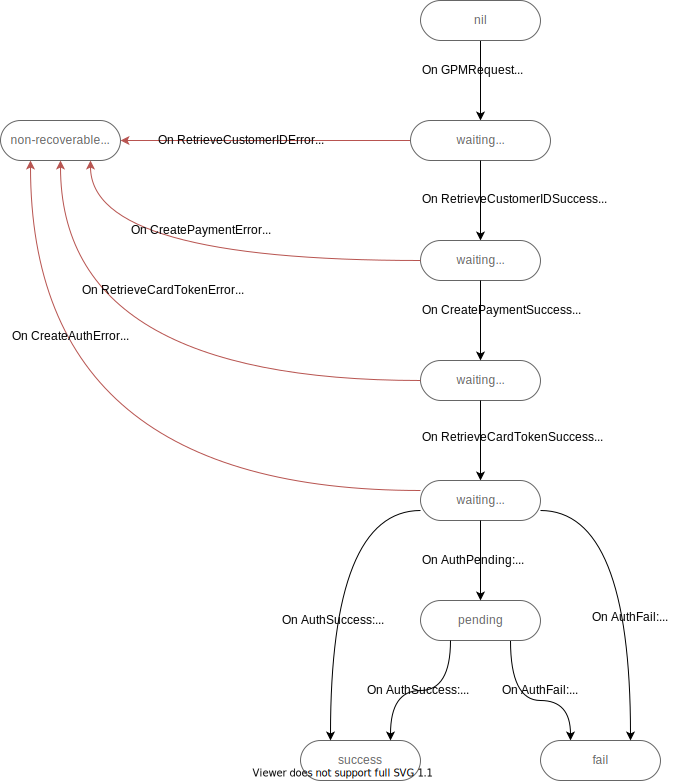

# fsm



Events can be fired as jobs to survive fsm crashes without losing events:
```
handleGPMRequest() {
    jobs.schedule("run_fsm", gpmRequestEvent)
}

handleZoozCallback() {
    jobs.schedule("run_fsm", authFailEvent)
}
```

Api call retries and zooz status polling are external jobs.
They emit results as state machine events.
```
createAuthJob() {
    status := zoozAPI.CreateAuth()
    if status == "pending" {
        fsm.Run(authPendingEvent) // no need for job
        jobs.schedule("auth_status_poller")
    } else {
       fsm.Run(authSuccessEvent)
    }
}
```

Re-sending results to GPM on duplicate request is not a part of state machine
(imagine we have a GetRequestState() api endpoint instead).
